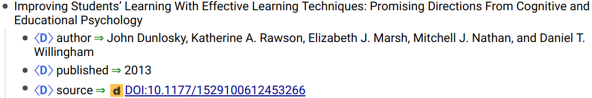

# Zotero & RemNote export

Copy references from Zotero and paste them into RemNote.



## Installation

Install style in Zotero:

- Go to `Options > Cite`, click the `+` and chose the `remnote-copyandpaste.csl` from this repository.
  - On Linux you can alteratively copy the file directly into Zotero's configuration folder:
```
cp remnote-copyandpaste.csl ~/Zotero/styles/
```
- Select style `RemNote Copy&Paste` in `Options > Export > Quick Copy`.

## Usage

1. Select reference(s) in zotero and press <kbd>Ctrl</kbd> + <kbd>Shift</kbd> + <kbd>C</kbd> (Quick Copy).
2. **Important:** Paste the reference first in a text editor (like VS Code, Sublime Text) and copy from there again. Otherwise line breaks are not preserved properly and the reference will end up on one line.
3. Paste the text in RemNote.

## Contributing

Feel free to open issues to discuss formatting and features.

You can edit the style yourself using the [CSL Visual Editor](https://editor.citationstyles.org/about/).

## Ideas and TODOs

- [ ] Make sure this works with different reference types: Papers, Books, Weblinks.
- [ ] Add my ideas from RemNote.
  - [ ] E.g. look into auto referencing names etc.
  - [ ] Option(?) to not use descriptors for author, published, etc.
- [ ] Maybe write pusblish date before title to be able to sort references automatically.
